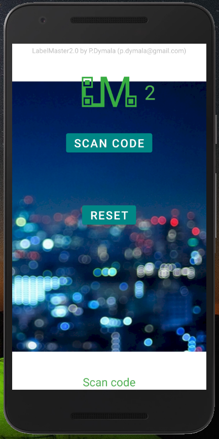

# LabelMaster2.1-Android
Application to check if a label is genuine by checking 2D code and it's existance in database via REST API. Part of LabelMaster 2

QR code may have any information like a number (e.g. 1234...)

After scanning application sends a requests to REST API server in order to check if such number exists in MySql database. Gives back the result indicating also with color.

For the REST API and it's configuration, check: https://github.com/PDymala/LabelMaster2.0-WebServer 

 
A sample label, in my case, this number was in the database:

  

2D code scanning thanks to https://github.com/yuriy-budiyev/code-scanner
